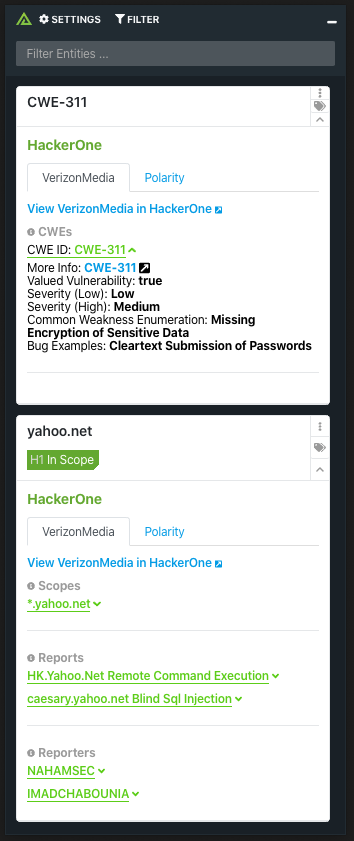
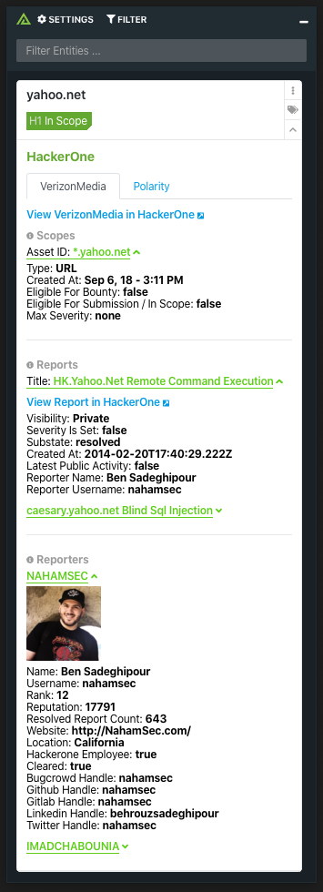

# HackerOne
### Operating System for Enterprise Security

# Polarity HackerOne Integration

HackerOne is a hacker-powered security platform that provides unmatched cybersecurity speed, depth and breadth of coverage at a greater value.
Polarity's HackerOne integration allows automated queries against HackerOne's API for all of your programs information relating to Scopes, Valued Vulnerabilities, Weaknesses, and Reports.

  
  

To learn more about HackerOne, visit the [official website](https://register.paloaltonetworks.com/introducingcortexxsoar).

## HackerOne Integration Options

### Email

The email associated with your HackerOne account

### Password

The password associated with your HackerOne account

### Programs to Search

A comma separated list of program IDs you would like to search on. These IDs can be found in the Program Page URL on the HackerOne Dashboard (https://hackerone.com/<program-id>...).  
You also have the ability to optionally add an alias for each of your program IDs using the structure "ProgramAlias>programId".

## Installation Instructions

Installation instructions for integrations are provided on the [PolarityIO GitHub Page](https://polarityio.github.io/).

## Polarity

Polarity is a memory-augmentation platform that improves and accelerates analyst decision making.  For more information about the Polarity platform please see:

https://polarity.io/
